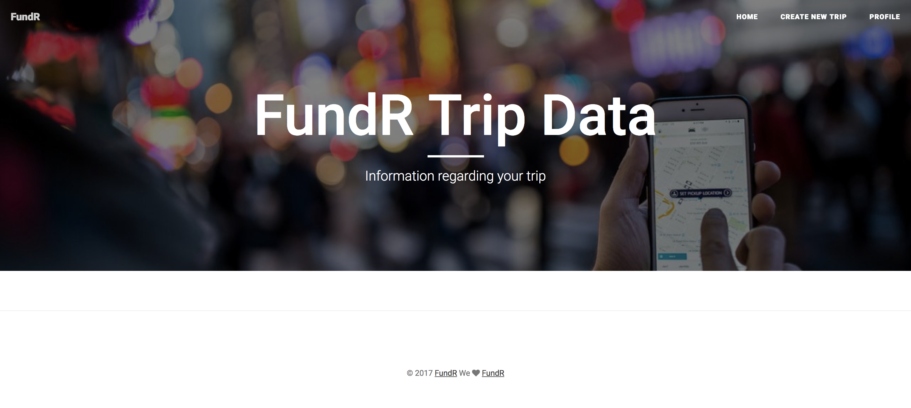
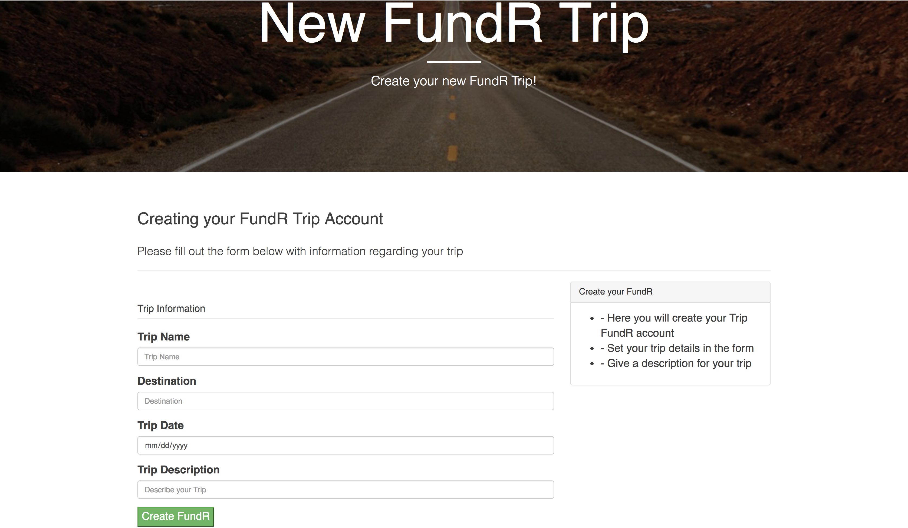

# FundR

FundR app is demonstrating MySQL, Node, Express, Handlebars and Sequelize.
Overall purpose is a web app designed to help organize and plan trips by setting goals for funds and items needed for your trips.
Set up web servers with Node.js using Express.

## Link to Page
* **https://limitless-eyrie-45922.herokuapp.com/**

## FundR Intro Page

## Sign-up Page

## Home Page

## FundR Trip Page

## FundR Profile Page

## FundR Create Trip Page

## Technologies Used
* **JavaScript**
* **jQuery**
* **AJAX**
* **Node.js**
* **Express**
* **Handlebars**
* **CSS-Bootstrap**
* **Sequelize**
* **Passport**

## The following npm modules were used
* **express**
* **body-parser**
* **mysql**
* **mysql2**
* **sequelize**
* **passport**
* **path**

## Getting Started
* **Clone or fork and run using server.js in the command line.**
* **Use localhost:8080**